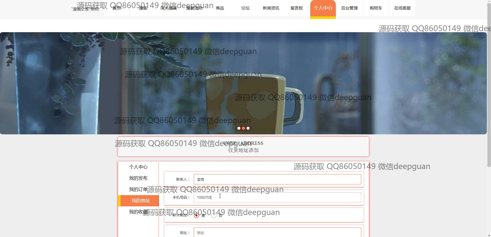
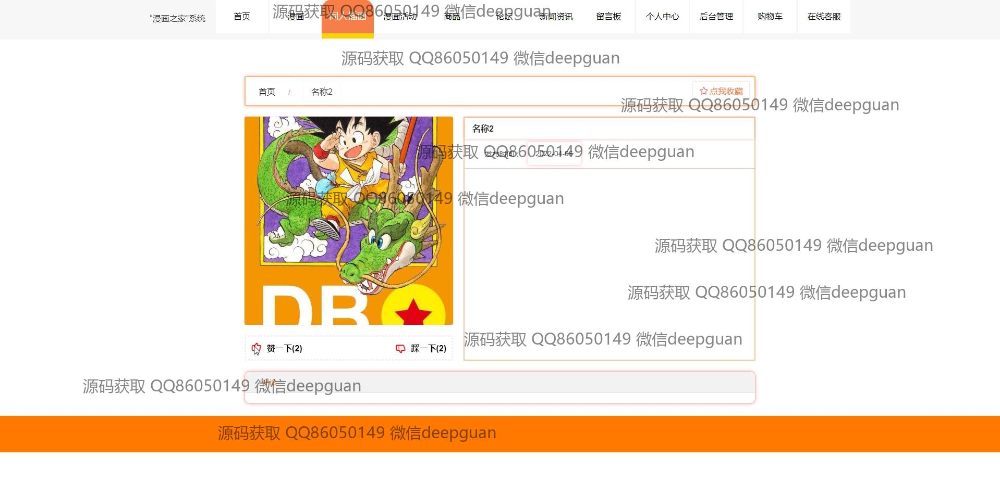
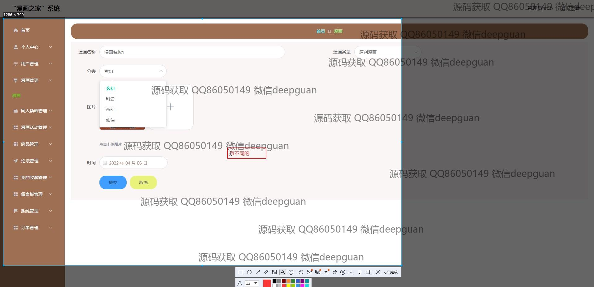

<h1 align="center">“漫画之家”系统</h1>

## 简介
漫画之家系统：角色分为管理员、用户；功能包括漫画浏览、上传、管理及分类，支持用户注册登录、个人信息管理、订单与商品管理、在线客服互动、论坛发帖等，旨在提供便捷的漫画阅读与管理体验。    --计算机毕业设计源码；毕设源码；java毕业设计源码

## 联系方式

<h3 align="center">获取完整代码与数据库文件 + 微信：deepguan QQ: 86050149 QQ群: 783742310</h3>

<h3 align="center">可帮忙远程部署 包运行成功！提供远程部署、修改代码、设计文档指导、代码讲解等服务！</h3>

## 功能介绍（完整见运行截图）
管理员： 基本功能包括登录、注册和退出。管理员可以访问漫画管理、商品管理、用户管理和论坛管理等模块，支持添加、编辑和管理漫画、商品及用户信息。系统提供订单管理功能，管理员可查看、处理订单，并执行退款操作。管理员通过用户管理模块维护用户账户信息，支持用户审核和角色分配。同时，可使用在线客服功能及时回应用户问题和建议。

用户： 用户可以进行注册和登录，进入系统后能访问个人中心修改个人信息，如用户名、密码、性别及联系方式。用户可管理漫画资源，通过搜索和分类功能浏览或检索漫画，再使用收藏和评论功能进行互动。用户可以将商品加入购物车并完成下单支付。通过订单管理可查询或处理已购买商品的信息，并可请求退款或与客服沟通解决问题。

## 运行截图

本代码来源于网络,仅供学习参考使用!

